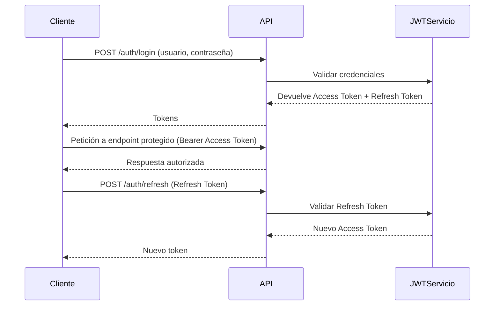
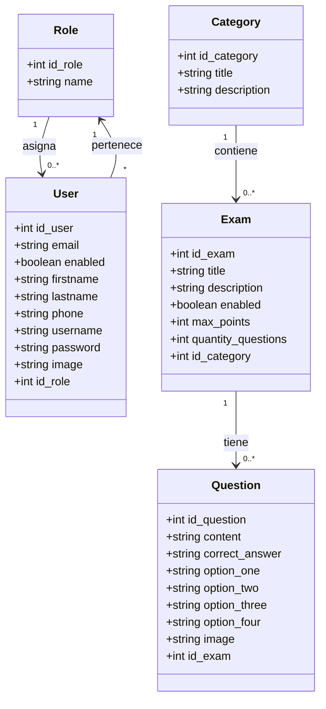

# Cervantes – Portal de Exámenes (API REST)

API REST desarrollada en Spring Boot siguiendo Arquitectura Hexagonal (Ports & Adapters), diseñada para gestionar un portal de exámenes con autenticación mediante JWT (access y refresh tokens), control de roles y módulos de gestión para categorías, exámenes y preguntas.

- Tecnologías:
    - Java 21
    - Spring Boot
    - Spring Security
    - Spring Data JPA
    - JWT Access & refresh tokens
    - SQL Server
- Seguridad por roles:
    - ADMIN
    - STUDENT
- Funcionalidades:
    - Login
    - Registro de estudiantes
    - Gestión de categorías
    - Gestión de exámenes
    - Gestión de preguntas
- Diseño flexible, mantenible y escalable

## Estructura del Proyecto
La estructura está organizada por entidades. Cada una tiene su propia carpeta raíz con tres subpaquetes:

```
src/
└── main/
    └── java/
        └── com/cervantes/pe/exam_platform/
            ├── common/
            │   ├── config/
            │   ├── exception/
            │   ├── response/   
            |   └── util/
            |       └── jwt/
            |
            ├── user/
            │   ├── domain/
            │   │   ├── in/
            │   │   └── out/
            │   ├── application/
            │   │   ├── entity/
            │   │   └── exception/
            │   └── infrastructure/
            │       ├── adapter/
            │       ├── controller/
            │       ├── dto/
            │       ├── mapper/
            │       ├── persistence/
            │       └── repository/
            |           └── impl/
            │   
            ├── role/
            │   ├── domain/
            │   │   ├── in/
            │   │   └── out/
            │   ├── application/
            │   │   ├── entity/
            │   │   └── exception/
            │   └── infrastructure/
            │       ├── adapter/
            │       ├── controller/
            │       ├── dto/
            │       ├── mapper/
            │       ├── persistence/
            │       └── repository/
            |           └── impl/
            ├── category/
            │   ├── domain/
            │   │   ├── in/
            │   │   └── out/
            │   ├── application/
            │   │   ├── entity/
            │   │   └── exception/
            │   └── infrastructure/
            │       ├── adapter/
            │       ├── controller/
            │       ├── dto/
            │       ├── mapper/
            │       ├── persistence/
            │       └── repository/
            |           └── impl/
            ├── exam/
            │   ├── domain/
            │   │   ├── in/
            │   │   └── out/
            │   ├── application/
            │   │   ├── entity/
            │   │   └── exception/
            │   └── infrastructure/
            │       ├── adapter/
            │       ├── controller/
            │       ├── dto/
            │       ├── mapper/
            │       ├── persistence/
            │       └── repository/
            |           └── impl/
            └── question/
                ├── domain/
                │   ├── in/
                │   └── out/
                ├── application/
                │   │   ├── entity/
                │   │   └── exception/
                └── infrastructure/
                    ├── adapter/
                    ├── controller/
                    ├── dto/
                    ├── mapper/
                    ├── persistence/
                    └── repository/
                        └── impl/
```


Este enfoque es una mezcla de Hexagonal Architecture (Ports & Adapters) y DDD (Domain-Driven Design), siguiendo buenas prácticas para aislar la lógica de dominio y organizar el código por contexto de negocio.

## Seguridad y Autenticación (JWT)


## Roles
- ADMIN: puede gestionar categorías, exámenes, preguntas y usuarios.
- STUDENT: puede acceder a exámenes asignados, ver preguntas y resultados.

## Modelo de Datos (ER)

